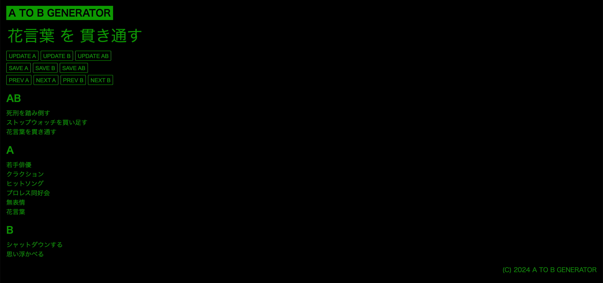

# A TO B GENERATOR



A to B Generator is a web browser application primarily designed for local use, focused on generating Japanese sentences that follow the specific format of "AをBする" (doing B to A). 

## Installation

To set up the application on your local environment, follow these steps:

### Clone the repository

First, clone the repository to your local machine:

```bash
git clone https://github.com/idutsu/a-to-b-generator.git
```

### Prerequisites

Before proceeding, ensure that `Node.js` is installed on your system. If you do not have Node.js installed, you can download and install it from [Node.js official website](https://nodejs.org/en).

### Install dependencies

Navigate to the application directory and install the required dependencies:

```bash
cd a-to-b-generator
npm install
```

### Start the application

Run the application using the following command:

```bash
npm start
```

By default, the server will start on port 8000. You can access the application by navigating to `http://localhost:8000` in your web browser.

## Japanese Dictionaries

This application uses [`SudachiDict`](https://github.com/WorksApplications/SudachiDict) to create Japanese example sentences :

- [`dic-a.csv`](https://github.com/idutsu/a-to-b-generator/tree/main/dic/dic-a.csv): Contains nouns.
- [`dic-b.csv`](https://github.com/idutsu/a-to-b-generator/tree/main/dic/dic-b.csv): Contains verbs.

## Usage

Here are the buttons functionalities:

- `Update A` Get a random word(A) from the noun dictionary.
- `Update B` Get a random word(B) from the verb dictionary.
- `Update AB` Update both A and B above.
- `Save A` Save the A to the favorites.
- `Save B` Save the B to the favorites.
- `Save AB` Save the the sentence(AB) to the favorites.
- `Next A` Select the next A from the history.
- `Prev A` Select the previous A from the history.
- `Next B` Select the next B from the history.
- `Prev B` Select the previous B from the history.
- `Delete` Delete the selected word form the favorites.
- `Use` Use the selected word in the favorites.


